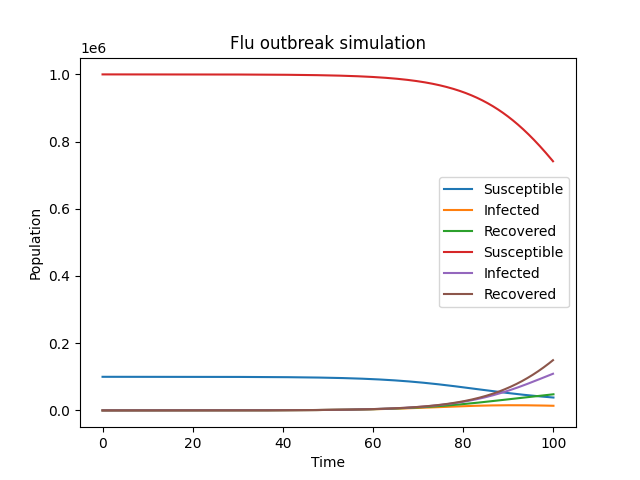
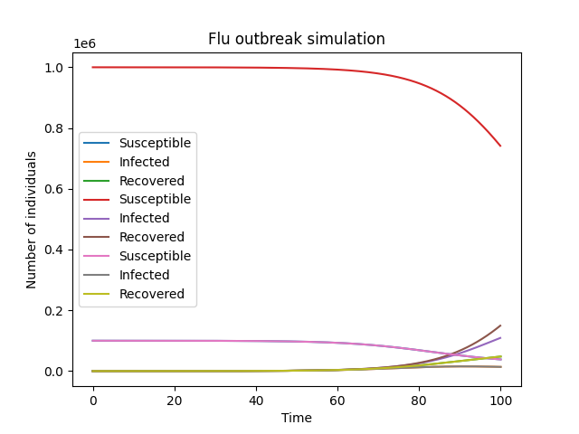

# Research Plan
Here's a breakdown of the topic into smaller sub-questions, along with suggested research methods, experiments, and datasets:

**Sub-question 1: What are the key factors that influence the spread of a flu outbreak in a city?**

* Research method: Literature review and statistical analysis of existing datasets
* Dataset: Historical flu outbreak data from cities, including demographic, environmental, and healthcare system factors
* Goal: Identify the most significant factors that contribute to the spread of flu outbreaks in cities

**Sub-question 2: How do individual behaviors and social networks affect the spread of flu in a city?**

* Research method: Social network analysis and agent-based modeling
* Experiment: Conduct surveys or online experiments to collect data on individual behaviors and social connections
* Dataset: Social media data, mobility data, or online survey responses
* Goal: Understand how individual behaviors and social networks influence the spread of flu in a city

**Sub-question 3: What is the impact of environmental factors, such as weather and air quality, on the spread of flu in a city?**

* Research method: Time-series analysis and regression modeling
* Dataset: Historical weather and air quality data, along with flu outbreak data
* Goal: Quantify the relationship between environmental factors and flu outbreak severity

**Sub-question 4: How effective are different prevention strategies, such as vaccination, mask-wearing, and social distancing, in reducing the spread of flu in a city?**

* Research method: Simulation modeling and scenario analysis
* Experiment: Design and simulate different prevention scenarios using agent-based models
* Dataset: Flu outbreak data, demographic data, and intervention data
* Goal: Compare the effectiveness of different prevention strategies in reducing flu outbreak spread

**Sub-question 5: What are the optimal resource allocation strategies for healthcare systems to respond to a flu outbreak in a city?**

* Research method: Optimization modeling and cost-effectiveness analysis
* Dataset: Healthcare system data, including hospital capacity, staff, and resource allocation
* Goal: Identify the most cost-effective resource allocation strategies for healthcare systems to respond to a flu outbreak

**Overall research goal:**
Develop a comprehensive simulation model that integrates individual behaviors, social networks, environmental factors, and prevention strategies to predict the spread of flu outbreaks in cities and propose evidence-based prevention strategies.

This research strategy will provide a holistic understanding of the complex factors that influence the spread of flu outbreaks in cities and inform data-driven prevention strategies to mitigate their impact.

# Experiment Output

